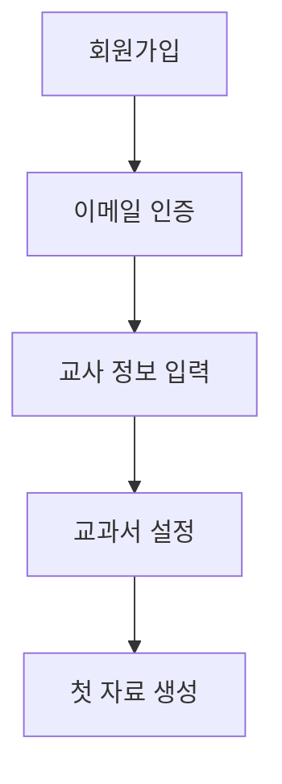
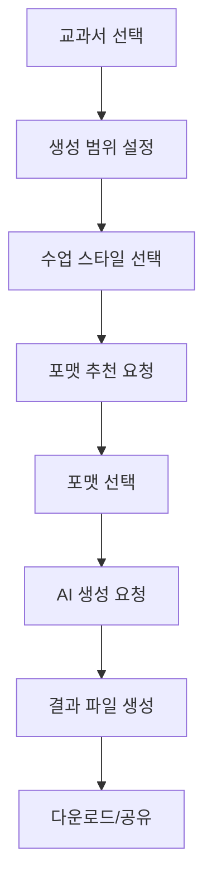
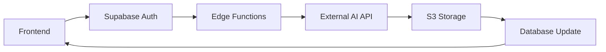

# MangoFactory 설계 플로우 - 코드 구조 가이드

> AI 기반 교육 자료 생성 플랫폼의 전체 아키텍처와 코드 구조를 설명합니다.

## 📋 목차

- [프로젝트 개요](#프로젝트-개요)
- [기술 스택](#기술-스택)
- [아키텍처 개요](#아키텍처-개요)
- [디렉토리 구조](#디렉토리-구조)
- [핵심 컴포넌트](#핵심-컴포넌트)
- [데이터베이스 설계](#데이터베이스-설계)
- [백엔드 API (Supabase Functions)](#백엔드-api-supabase-functions)
- [프론트엔드 구조](#프론트엔드-구조)
- [주요 플로우](#주요-플로우)
- [개발 환경 설정](#개발-환경-설정)

## 🎯 프로젝트 개요

**MangoFactory**는 교사들을 위한 AI 기반 맞춤형 교육 자료 생성 플랫폼입니다.

### 주요 기능
- 🤖 **AI 맞춤 생성**: 학급 정보와 교육과정에 맞는 교육 자료 자동 생성
- 📚 **교과서 기반**: 실제 교과서 내용을 기반으로 한 정확한 자료 제작
- 🎨 **다양한 포맷**: 워크시트, PPT, 활동지, 퀴즈 등 다양한 형태 지원
- 👥 **협업 기능**: 교사 간 자료 공유 및 피드백
- ⚙️ **개인화 설정**: 개별 교사의 수업 스타일 반영

## 🛠 기술 스택

### Frontend
- **Framework**: React 18.3.1 with TypeScript
- **Build Tool**: Vite 5.4.1
- **UI Components**: shadcn/ui (Radix UI 기반)
- **Styling**: Tailwind CSS 3.4.11
- **State Management**: TanStack Query 5.56.2
- **Routing**: React Router DOM 6.26.2
- **Forms**: React Hook Form 7.53.0 + Zod 3.23.8

### Backend
- **BaaS**: Supabase (PostgreSQL + Auth + Edge Functions)
- **Edge Functions**: Deno runtime
- **File Storage**: AWS S3 (Supabase Functions를 통한 프록시)
- **Authentication**: Supabase Auth

### DevOps & Tools
- **Package Manager**: npm
- **Linting**: ESLint 9.9.0 with TypeScript support
- **Type Checking**: TypeScript 5.5.3
- **CSS Processing**: PostCSS + Autoprefixer

## 🏗 아키텍처 개요

```
┌─────────────────┐    ┌─────────────────┐    ┌─────────────────┐
│   Frontend      │    │   Supabase      │    │  External AI    │
│   (React SPA)   │◄──►│   (Backend)     │◄──►│   Backend       │
│                 │    │                 │    │                 │
│ • UI Components │    │ • Auth          │    │ • Content Gen   │
│ • State Mgmt    │    │ • Database      │    │ • Format Rec    │
│ • Routing       │    │ • Edge Functions│    │ • File Process  │
└─────────────────┘    └─────────────────┘    └─────────────────┘
                              │
                              ▼
                       ┌─────────────────┐
                       │   File Storage  │
                       │   (AWS S3)      │
                       └─────────────────┘
```

## 📁 디렉토리 구조

```
mango-factory-design-flow/
├── public/                          # 정적 파일
│   ├── favicon.ico
│   ├── mango-favicon.png
│   └── robots.txt
├── src/                             # 소스 코드
│   ├── components/                  # React 컴포넌트
│   │   ├── layout/                  # 레이아웃 컴포넌트
│   │   │   └── Layout.tsx          # 메인 레이아웃 (사이드바 + 헤더)
│   │   ├── ui/                     # shadcn/ui 기본 컴포넌트들
│   │   │   ├── button.tsx
│   │   │   ├── card.tsx
│   │   │   ├── input.tsx
│   │   │   └── ... (40+ UI 컴포넌트)
│   │   ├── MangoSidebar.tsx        # 메인 네비게이션 사이드바
│   │   └── ProfileImage.tsx        # 사용자 프로필 이미지
│   ├── pages/                      # 페이지 컴포넌트
│   │   ├── Index.tsx               # 랜딩 페이지 (Home 래핑)
│   │   ├── Home.tsx                # 홈페이지 (히어로 섹션, 기능 소개)
│   │   ├── Auth.tsx                # 로그인/회원가입
│   │   ├── Generate.tsx            # AI 자료 생성 메인 페이지
│   │   ├── History.tsx             # 생성 이력 관리
│   │   ├── GenerationDetail.tsx    # 개별 생성 자료 상세
│   │   ├── Settings.tsx            # 사용자 설정
│   │   ├── Support.tsx             # 고객 지원
│   │   ├── Billing.tsx             # 요금제 관리
│   │   └── NotFound.tsx            # 404 페이지
│   ├── hooks/                      # 커스텀 React 훅
│   │   ├── use-auth.tsx            # 인증 상태 관리
│   │   ├── use-mobile.tsx          # 모바일 감지
│   │   └── useFileUpload.tsx       # 파일 업로드
│   ├── integrations/               # 외부 서비스 통합
│   │   └── supabase/
│   │       ├── client.ts           # Supabase 클라이언트 설정
│   │       └── types.ts            # 데이터베이스 타입 정의 (자동 생성)
│   ├── config/                     # 설정 파일
│   │   └── supabase.ts            # Supabase 설정
│   ├── lib/                        # 유틸리티 라이브러리
│   │   └── utils.ts               # 공통 유틸리티 함수
│   ├── assets/                     # 정적 자산
│   │   ├── hero-illustration.jpg
│   │   └── feature-icons.jpg
│   ├── App.tsx                     # 메인 App 컴포넌트
│   ├── main.tsx                    # React 앱 엔트리포인트
│   └── index.css                   # 글로벌 스타일
├── supabase/                       # Supabase 백엔드 설정
│   ├── config.toml                 # Supabase 프로젝트 설정
│   ├── functions/                  # Edge Functions (서버리스 API)
│   │   ├── request-generation/     # AI 자료 생성 요청
│   │   ├── request-format-recommendation/ # 포맷 추천 요청
│   │   ├── analyze-course-material/# 교과서 내용 분석
│   │   ├── analyze-generation-format/ # 생성 포맷 분석
│   │   ├── upload-s3-file/         # S3 파일 업로드
│   │   ├── download-s3-file/       # S3 파일 다운로드
│   │   ├── secure-download/        # 보안 파일 다운로드
│   │   ├── verify-admin-access/    # 관리자 권한 확인
│   │   ├── admin-teacher-data/     # 관리자용 교사 데이터
│   │   ├── admin-help-requests/    # 관리자용 지원 요청
│   │   └── whoami/                 # 사용자 정보 확인
│   └── migrations/                 # 데이터베이스 마이그레이션
│       ├── 0_base_migration_fixed.sql
│       └── ... (추가 마이그레이션)
├── package.json                    # 프로젝트 의존성 및 스크립트
├── tsconfig.json                   # TypeScript 설정
├── tailwind.config.ts              # Tailwind CSS 설정
├── vite.config.ts                  # Vite 빌드 설정
└── components.json                 # shadcn/ui 컴포넌트 설정
```

## 🧩 핵심 컴포넌트

### 1. 인증 시스템 (`src/hooks/use-auth.tsx`)
- Supabase Auth 기반 사용자 인증
- React Context를 통한 전역 상태 관리
- 자동 세션 관리 및 토큰 갱신

### 2. 레이아웃 시스템 (`src/components/layout/Layout.tsx`)
- 반응형 사이드바 네비게이션
- 사용자 드롭다운 메뉴
- 보호된 라우트 래핑

### 3. AI 자료 생성 (`src/pages/Generate.tsx`)
- 다단계 폼 인터페이스 (정보 입력 → 포맷 선택 → 생성 → 결과)
- 실시간 진행률 표시
- 교과서 기반 범위 선택
- AI 추천 및 수동 설정 옵션

### 4. 생성 이력 관리 (`src/pages/History.tsx`)
- 페이지네이션된 자료 목록
- 검색 및 필터링 기능
- 파일 다운로드 기능

## 🗄 데이터베이스 설계

### 핵심 테이블 구조

#### 사용자 관련
- `profiles`: 사용자 프로필 정보
- `teacher_info`: 교사 상세 정보 (학급, 검증 상태 등)
- `admin_users`: 관리자 사용자 관리

#### 교육 컨텐츠
- `courses`: 교과 정보 (학년, 학기, 과목)
- `course_types`: 과목 분류 (국어, 수학, 과학 등)
- `raw_course_materials`: 원본 교과서 데이터
- `course_materials`: 처리된 교과서 데이터
- `course_material_structure_only`: 교과서 구조 정보

#### AI 생성 관련
- `generation_attrs`: 생성 요청 속성
- `generation_requests`: 생성 요청 기록
- `generation_responses`: 생성 결과 및 파일 경로
- `raw_generation_formats`: 생성 포맷 템플릿

#### 설정 및 매핑
- `teaching_styles`: 수업 스타일 정의
- `cowork_types`: 협업 방식 정의
- `format_selection_attrs`: 포맷 선택 속성
- 다양한 매핑 테이블들 (`*_map`)

### 주요 관계
```sql
users (Supabase Auth)
  ├── profiles (1:1)
  ├── teacher_info (1:1)
  └── generation_responses (1:N)

courses
  ├── raw_course_materials (1:N)
  └── course_materials (1:N)

generation_attrs
  ├── generation_requests (1:N)
  └── generation_responses (1:N)
```

## 🔌 백엔드 API (Supabase Functions)

### 주요 Edge Functions

#### 1. `request-generation`
- **목적**: AI 자료 생성 요청 처리
- **플로우**: 
  1. 생성 속성 검증
  2. 외부 AI 백엔드 API 호출
  3. 결과 데이터베이스 저장
  4. 파일 경로 반환

#### 2. `request-format-recommendation`
- **목적**: 사용자 선호도 기반 포맷 추천
- **입력**: 교수 스타일, 협업 방식, 교과 내용
- **출력**: 추천 포맷 리스트

#### 3. `analyze-course-material`
- **목적**: 교과서 내용 AI 분석
- **기능**: 구조 파싱, 내용 추출, 메타데이터 생성

#### 4. S3 파일 관리 함수들
- `upload-s3-file`: 파일 업로드
- `download-s3-file`: 파일 다운로드
- `secure-download`: 인증된 파일 접근

#### 5. 관리자 함수들
- `verify-admin-access`: 관리자 권한 검증
- `admin-teacher-data`: 교사 데이터 관리
- `admin-help-requests`: 지원 요청 관리

### 보안 설정
```toml
# supabase/config.toml
[functions.request-generation]
verify_jwt = true  # JWT 토큰 검증 필요

[functions.secure-download]
verify_jwt = true  # 인증된 다운로드만 허용
```

## 🎨 프론트엔드 구조

### 컴포넌트 아키텍처
```
App.tsx
├── AuthProvider (전역 인증 상태)
├── QueryClientProvider (데이터 캐싱)
├── TooltipProvider (UI 툴팁)
└── BrowserRouter
    ├── ProtectedRoute (인증 필요 페이지)
    └── Layout (사이드바 + 헤더)
        └── Page Components
```

### 주요 페이지 구조

#### Home.tsx (랜딩 페이지)
- 히어로 섹션: 서비스 소개 및 CTA
- 기능 소개: 4가지 핵심 기능 카드
- 요금제: 무료/프리미엄/학교 플랜
- 반응형 디자인 및 애니메이션

#### Generate.tsx (자료 생성)
```typescript
interface GenerateStep {
  'info': 교과서 선택, 범위 설정, 수업 스타일 선택
  'format': AI 추천 포맷 선택
  'generating': 실시간 진행률 표시
  'result': 완료된 자료 다운로드
}
```

#### History.tsx (이력 관리)
- 무한 스크롤 대신 페이지네이션 사용
- 실시간 검색 및 필터링
- 카드 기반 그리드 레이아웃

### UI/UX 패턴
- **Design System**: shadcn/ui 기반 일관된 컴포넌트
- **Color Scheme**: CSS 변수 기반 다크/라이트 모드 지원
- **Responsive**: Tailwind의 모바일 퍼스트 접근법
- **Accessibility**: ARIA 레이블 및 키보드 네비게이션

## 🔄 주요 플로우

### 1. 사용자 온보딩


### 2. AI 자료 생성 플로우


### 3. 데이터 플로우


## ⚙️ 개발 환경 설정

### 필수 요구사항
- Node.js 18+ 
- npm 또는 yarn
- Supabase CLI (로컬 개발용)

### 환경 변수
```env
VITE_SUPABASE_URL=your_supabase_url
VITE_SUPABASE_ANON_KEY=your_supabase_anon_key
```

### 개발 서버 실행
```bash
# 의존성 설치
npm install

# 개발 서버 시작
npm run dev

# Supabase 로컬 개발 (선택사항)
supabase start
```

### 빌드 및 배포
```bash
# 프로덕션 빌드
npm run build

# 빌드 미리보기
npm run preview
```

## 📊 성능 최적화

### Frontend 최적화
- **Code Splitting**: React.lazy를 통한 페이지별 분할
- **Image Optimization**: WebP 포맷 및 적응형 이미지
- **Bundle Analysis**: Vite 번들 분석기 사용
- **Caching**: TanStack Query를 통한 데이터 캐싱

### Backend 최적화
- **Database Indexing**: 주요 쿼리 경로 인덱싱
- **Edge Functions**: 지역별 CDN 배포
- **File Storage**: S3 CDN 연동

## 🔐 보안 고려사항

### 인증 및 권한
- JWT 토큰 기반 인증
- Row Level Security (RLS) 정책 적용
- 관리자 권한 분리

### 데이터 보호
- 민감 정보 암호화
- CORS 정책 설정
- Rate Limiting 적용

### 파일 보안
- 서명된 URL 사용
- 파일 타입 검증
- 바이러스 스캔 (향후 계획)

---

이 문서는 MangoFactory 프로젝트의 전체적인 구조와 설계 철학을 이해하는 데 도움이 되도록 작성되었습니다. 추가 질문이나 특정 부분에 대한 자세한 설명이 필요하시면 언제든 문의해 주세요.
